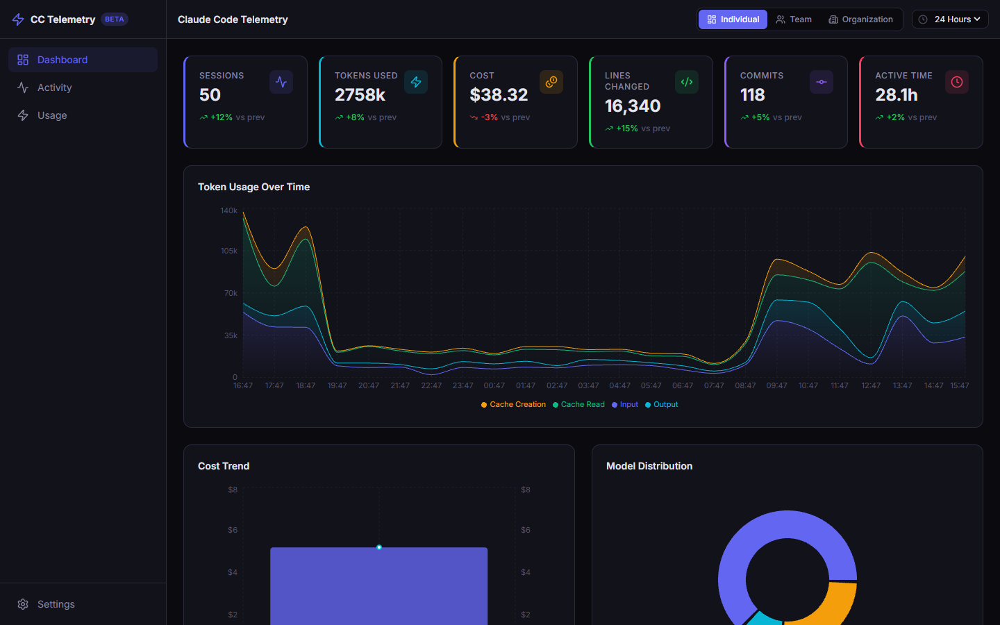
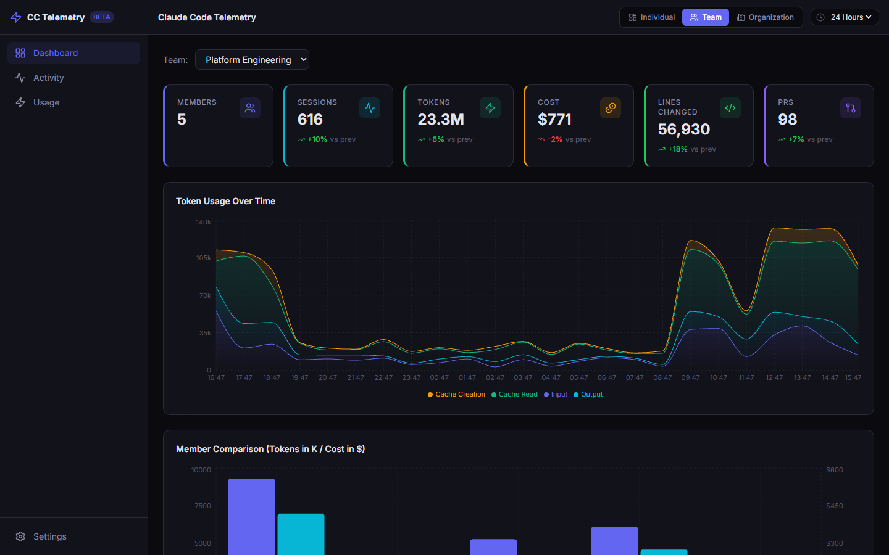
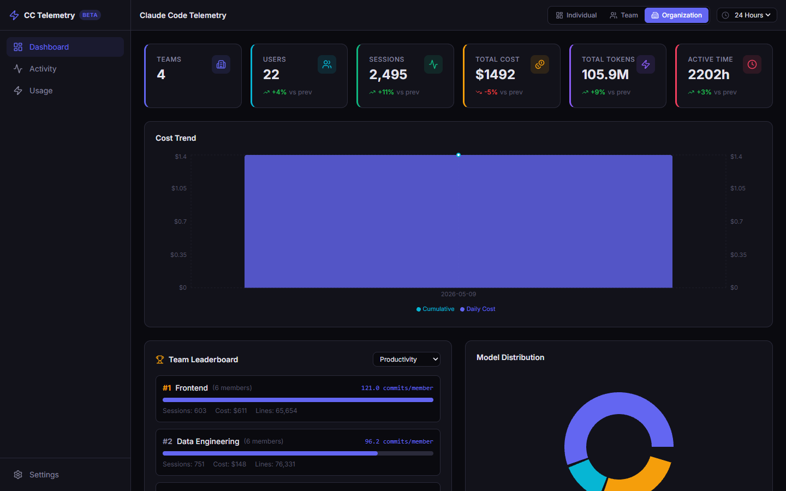
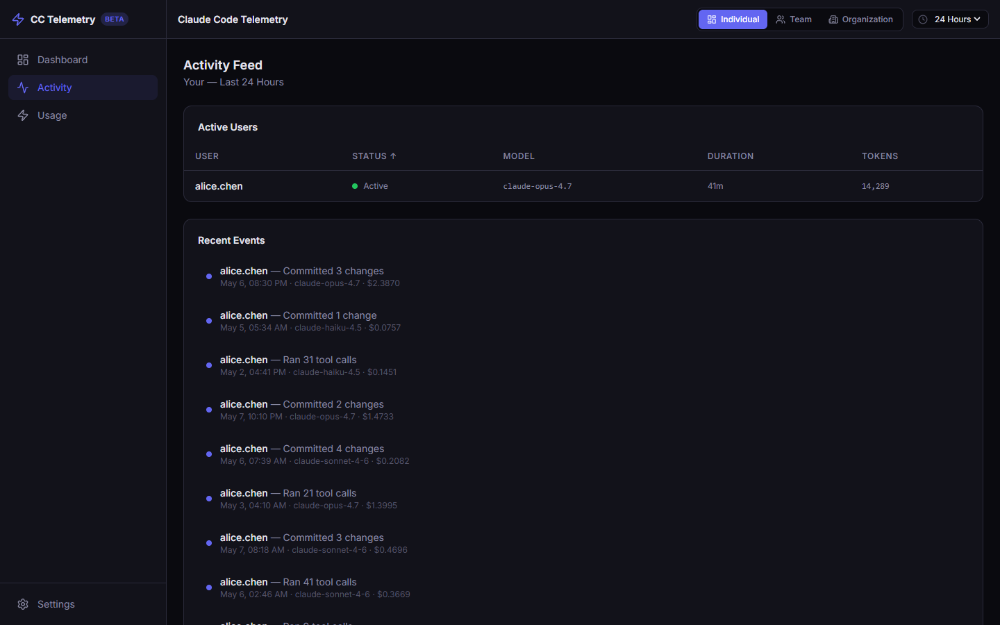
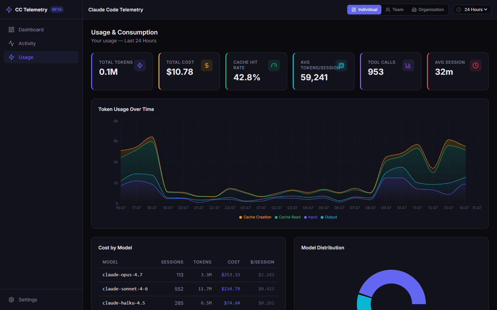
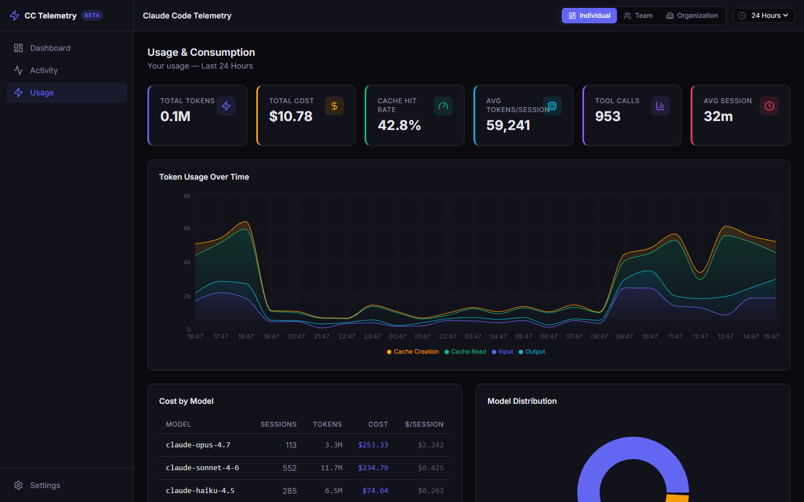

# Claude Code Telemetry Dashboard

A modern, responsive observability dashboard for monitoring [Claude Code](https://docs.anthropic.com/en/docs/claude-code) usage, costs, and productivity across individuals, teams, and organizations. Built on [OpenTelemetry](https://opentelemetry.io/) standards with a complete observability stack.


---

## Table of Contents

- [Overview](#overview)
- [Screenshots](#screenshots)
- [Features](#features)
- [Architecture](#architecture)
- [Quick Start](#quick-start)
- [Project Structure](#project-structure)
- [Pages & Views](#pages--views)
- [Claude Code Telemetry Setup](#claude-code-telemetry-setup)
- [Observability Stack](#observability-stack)
- [Metrics Reference](#metrics-reference)
- [Connecting Live Data](#connecting-live-data)
- [Customization](#customization)
- [Production Deployment](#production-deployment)
- [Troubleshooting](#troubleshooting)
- [Official References](#official-references)

---

## Overview

[Claude Code](https://docs.anthropic.com/en/docs/claude-code) natively exports telemetry via [OpenTelemetry (OTel)](https://opentelemetry.io/), including **metrics**, **events/logs**, and **traces** ([docs](https://docs.anthropic.com/en/docs/claude-code/monitoring-usage)). This project provides:

1. **A React dashboard** — Real-time visualization of Claude Code metrics with individual, team, and org-level views across three pages (Dashboard, Activity, Usage)
2. **An OTel Collector** — Receives telemetry from Claude Code instances via OTLP ([spec](https://opentelemetry.io/docs/collector/))
3. **Prometheus** — Time-series storage for metrics ([docs](https://prometheus.io/docs/prometheus/latest/querying/basics/))
4. **Grafana** — Additional dashboarding and alerting ([docs](https://grafana.com/docs/grafana/latest/))
5. **Mock data layer** — Realistic simulated data for development and demos (no backend required)

---

## Screenshots

### Dashboard — Individual View

Your personal Claude Code metrics: sessions, tokens, cost, lines changed, commits, and active time with detailed charts.



### Dashboard — Team View

Aggregated metrics for your team with a team selector, member comparison, and token usage trends.



### Dashboard — Organization View

Executive-level view: team leaderboard (sortable by productivity, cost efficiency, or adoption), cost trends, and model distribution across all teams.



### Activity Page

Real-time activity feed showing active users (with status indicators), recent events, and a full searchable/sortable/paginated session history. Scopes to Individual, Team, or Organization via the header pills.



### Usage Page

Token consumption breakdown, cost-by-model table, model distribution, tool usage frequency/success rates, and cache efficiency metrics.



### Usage — Token Type Breakdown

Detailed per-type breakdown (Input, Output, Cache Read, Cache Creation) with progress bars showing percentage of total consumption.



---

## Features

### 🗂️ Three Pages

| Page | Description |
|------|-------------|
| **Dashboard** | Overview with stat cards, token usage chart, cost trends, model distribution, productivity, and tool usage |
| **Activity** | Live activity feed, active users table, recent events timeline, full session history |
| **Usage** | Token consumption analysis, cost-by-model table, cache hit rates, tool success rates, token type breakdown |

### 🔍 Three Scope Levels (applied to every page)

| Scope | Description |
|-------|-------------|
| **Individual** | Your personal metrics — scoped to the current user |
| **Team** | Team-wide aggregation — includes a team selector dropdown to switch between teams |
| **Organization** | Org-wide rollups — all teams and all users |

### 📊 Visualizations

- **Token Usage Over Time** — Stacked area chart (input, output, cache read, cache creation) using [Recharts](https://recharts.org/en-US/) `AreaChart`
- **Cost Trends** — Daily cost bars with cumulative line overlay via `ComposedChart`
- **Model Distribution** — Donut chart of model usage by sessions and cost
- **Tool Usage** — Horizontal bar chart with call counts, avg duration, and success rates
- **Productivity** — Lines added/removed (bars) + commits (line) over time
- **Team Leaderboard** — Teams ranked by selectable metric (cost efficiency, productivity, adoption)
- **Active Users** — Real-time table with status indicators (🟢 active, 🟡 idle, ⚫ offline)
- **Sessions Table** — Paginated, searchable, sortable, with expandable detail rows
- **Token Breakdown** — Per-type cards with progress bars and percentage of total
- **Cost by Model** — Sortable table showing sessions, tokens, cost, and $/session per model

### 🎨 Design

- Dark theme with glassmorphism cards (`bg-[#12121a]`, `border-[#2a2a3a]`)
- Fully responsive (mobile sidebar collapses, tables scroll horizontally)
- Collapsible sidebar navigation with functional page routing
- Indigo accent (`#6366f1`) with color-coded metric cards
- Smooth hover transitions and custom scrollbars
- [Inter](https://fonts.google.com/specimen/Inter) typeface via Google Fonts

---

## Architecture

```
┌─────────────────────────────┐
│     Claude Code CLI         │  CLAUDE_CODE_ENABLE_TELEMETRY=1
│     (Developer 1..N)        │  OTEL_METRICS_EXPORTER=otlp
│                             │  OTEL_LOGS_EXPORTER=otlp
│  Env: OTEL_RESOURCE_ATTRIBUTES="team.id=platform"
└──────────┬──────────────────┘
           │ OTLP (gRPC :4317 / HTTP :4318)
           ▼
┌──────────────────────────────┐
│   OpenTelemetry Collector    │  Receives, batches, processes
│   otel-collector-config.yaml │  telemetry from all instances
│   :4317 gRPC  :4318 HTTP     │
│   :8889 Prometheus export    │
└──────────┬───────────────────┘
           │ Scrape (/metrics)
           ▼
┌──────────────────────┐     ┌──────────────────────┐
│   Prometheus         │────▶│   Grafana            │
│   :9090              │     │   :3000              │
│   prometheus.yml     │     │   (pre-configured)   │
└──────────┬───────────┘     └──────────────────────┘
           │ PromQL API (/api/v1/query)
           ▼
┌──────────────────────────────┐
│   React Dashboard            │
│   :5173 (dev) / :80 (prod)   │
│   Vite proxy → Prometheus    │
└──────────────────────────────┘
```

> **Source**: This architecture follows the [OpenTelemetry Collector deployment pattern](https://opentelemetry.io/docs/collector/deployment/) and Claude Code's [official monitoring documentation](https://docs.anthropic.com/en/docs/claude-code/monitoring-usage).

---

## Quick Start

### Option 1: Dashboard Only (Development)

```bash
cd dashboard
npm install
npm run dev
```

Open [http://localhost:5173](http://localhost:5173). The dashboard runs with **mock data** — no backend needed.

### Option 2: Full Observability Stack (Docker Compose)

```bash
docker compose up -d
```

| Service | URL | Purpose |
|---------|-----|---------|
| Dashboard | [http://localhost:5173](http://localhost:5173) | React telemetry dashboard |
| Grafana | [http://localhost:3000](http://localhost:3000) | Additional dashboards & alerting |
| Prometheus | [http://localhost:9090](http://localhost:9090) | Metrics storage & PromQL |
| OTel Collector (gRPC) | `localhost:4317` | Telemetry ingestion (gRPC) |
| OTel Collector (HTTP) | `localhost:4318` | Telemetry ingestion (HTTP) |

### Option 3: Connect Claude Code to the Stack

After starting the stack, configure your Claude Code instances per the [official docs](https://docs.anthropic.com/en/docs/claude-code/monitoring-usage):

```bash
# Required: Enable telemetry
export CLAUDE_CODE_ENABLE_TELEMETRY=1

# Configure OTLP export
export OTEL_METRICS_EXPORTER=otlp
export OTEL_LOGS_EXPORTER=otlp
export OTEL_EXPORTER_OTLP_PROTOCOL=grpc
export OTEL_EXPORTER_OTLP_ENDPOINT=http://localhost:4317

# Optional: Enable distributed tracing (beta)
export CLAUDE_CODE_ENHANCED_TELEMETRY_BETA=1
export OTEL_TRACES_EXPORTER=otlp

# Optional: Add team/department context for multi-team dashboards
export OTEL_RESOURCE_ATTRIBUTES="department=engineering,team.id=platform,cost_center=eng-123"

# Launch Claude Code
claude
```

> **Reference**: See [Claude Code Monitoring & Usage](https://docs.anthropic.com/en/docs/claude-code/monitoring-usage) for the complete configuration guide.

---

## Project Structure

```
CC-Telemetry/
├── README.md                          # This file
├── LICENSE                            # MIT License
├── docker-compose.yml                 # Full observability stack
├── otel-collector-config.yaml         # OTel Collector configuration
├── prometheus.yml                     # Prometheus scrape config
├── docs/
│   └── screenshots/                   # Dashboard screenshots
├── grafana/
│   └── provisioning/
│       └── datasources/
│           └── datasource.yml         # Grafana ← Prometheus datasource
├── dashboard/
│   ├── Dockerfile                     # Multi-stage build (node → nginx)
│   ├── nginx.conf                     # SPA routing for production
│   ├── package.json
│   ├── vite.config.ts                 # Vite + Tailwind + Prometheus proxy
│   ├── index.html
│   ├── public/
│   │   └── favicon.svg
│   └── src/
│       ├── main.tsx                   # Entry point
│       ├── App.tsx                    # Root: page + view routing
│       ├── index.css                  # Tailwind theme tokens
│       ├── types.ts                   # TypeScript interfaces
│       ├── data/
│       │   └── mockData.ts            # Realistic mock data generators
│       ├── components/
│       │   ├── Layout.tsx             # Sidebar + header + view switcher
│       │   ├── StatCard.tsx           # Reusable metric cards with trends
│       │   ├── ActiveUsersTable.tsx   # Real-time user status table
│       │   ├── SessionsTable.tsx      # Paginated session history
│       │   ├── TeamLeaderboard.tsx    # Team ranking component
│       │   └── charts/
│       │       ├── TokenUsageChart.tsx        # Stacked area chart
│       │       ├── CostTrendChart.tsx         # Bar + line composed chart
│       │       ├── ModelDistributionChart.tsx  # Donut pie chart
│       │       ├── ToolUsageChart.tsx          # Horizontal bar chart
│       │       └── ProductivityChart.tsx       # Lines + commits chart
│       └── views/
│           ├── IndividualView.tsx     # Dashboard: personal metrics
│           ├── TeamView.tsx           # Dashboard: team-level metrics
│           ├── OrgView.tsx            # Dashboard: organization-wide
│           ├── ActivityView.tsx       # Activity: feed + sessions
│           └── UsageView.tsx          # Usage: tokens + cost analysis
```

---

## Pages & Views

### Dashboard Page

The main overview page. Content changes based on scope level:

| Scope | Stat Cards | Charts | Tables |
|-------|-----------|--------|--------|
| **Individual** | Sessions, Tokens, Cost, Lines, Commits, Active Time | Token usage, cost trend, model distribution, tool usage, productivity | Recent sessions |
| **Team** | Members, Sessions, Tokens, Cost, Lines, PRs | Token usage, member comparison | Active users, tool usage |
| **Organization** | Teams, Users, Sessions, Cost, Tokens, Active Time | Cost trend, model distribution | Team leaderboard, team comparison |

### Activity Page

Real-time activity tracking scoped by Individual/Team/Organization:

- **Active Users** — Live status table (active 🟢, idle 🟡, offline ⚫)
- **Recent Events** — Timeline of commits, PRs, and tool activity
- **Sessions Table** — Full history with search, sort, pagination, and expandable details
- **Team Selector** — Dropdown appears in Team view to switch teams

### Usage Page

Deep-dive into consumption and efficiency, scoped by Individual/Team/Organization:

- **Stat Cards** — Total Tokens, Total Cost, Cache Hit Rate, Avg Tokens/Session, Tool Calls, Avg Session Duration
- **Token Usage Chart** — Stacked area over time
- **Cost by Model Table** — Sessions, tokens, cost, and $/session per model
- **Model Distribution** — Donut chart
- **Tool Usage** — Bar chart with success rates
- **Token Type Breakdown** — Cards with progress bars (Input, Output, Cache Read, Cache Creation)

---

## Claude Code Telemetry Setup

### Environment Variables

Claude Code exports telemetry via standard [OpenTelemetry environment variables](https://github.com/open-telemetry/opentelemetry-specification/blob/main/specification/protocol/exporter.md#configuration-options). Full reference: [Claude Code Monitoring Docs](https://docs.anthropic.com/en/docs/claude-code/monitoring-usage).

| Variable | Description | Values |
|----------|-------------|--------|
| `CLAUDE_CODE_ENABLE_TELEMETRY` | **Required** — Enable telemetry | `1` |
| `OTEL_METRICS_EXPORTER` | Metrics exporter ([docs](https://docs.anthropic.com/en/docs/claude-code/monitoring-usage#common-configuration-variables)) | `otlp`, `prometheus`, `console`, `none` |
| `OTEL_LOGS_EXPORTER` | Logs/events exporter | `otlp`, `console`, `none` |
| `OTEL_TRACES_EXPORTER` | Traces exporter ([beta](https://docs.anthropic.com/en/docs/claude-code/monitoring-usage#traces-beta)) | `otlp`, `console`, `none` |
| `OTEL_EXPORTER_OTLP_PROTOCOL` | Transport protocol | `grpc`, `http/json`, `http/protobuf` |
| `OTEL_EXPORTER_OTLP_ENDPOINT` | Collector endpoint | `http://localhost:4317` |
| `OTEL_EXPORTER_OTLP_HEADERS` | Auth headers ([mTLS](https://docs.anthropic.com/en/docs/claude-code/monitoring-usage#mtls-authentication)) | `Authorization=Bearer <token>` |
| `OTEL_METRIC_EXPORT_INTERVAL` | Export interval (ms, default: 60000) | `5000`, `60000` |
| `OTEL_RESOURCE_ATTRIBUTES` | Custom attributes ([multi-team](https://docs.anthropic.com/en/docs/claude-code/monitoring-usage#multi-team-organization-support)) | `team.id=platform,cost_center=123` |
| `CLAUDE_CODE_ENHANCED_TELEMETRY_BETA` | Enable span tracing | `1` |

### Privacy & Data Controls

All telemetry is **opt-in** with sensitive data redacted by default. See [official privacy docs](https://docs.anthropic.com/en/docs/claude-code/monitoring-usage#common-configuration-variables).

| Variable | Description | Default |
|----------|-------------|---------|
| `OTEL_LOG_USER_PROMPTS` | Include prompt content in events | Disabled |
| `OTEL_LOG_TOOL_DETAILS` | Include tool parameters/commands | Disabled |
| `OTEL_LOG_TOOL_CONTENT` | Include tool I/O content in spans | Disabled |
| `OTEL_LOG_RAW_API_BODIES` | Emit full API request/response JSON | Disabled |
| `OTEL_METRICS_INCLUDE_SESSION_ID` | Attach `session.id` to metrics | `true` |
| `OTEL_METRICS_INCLUDE_ACCOUNT_UUID` | Attach `user.account_uuid` | `true` |
| `OTEL_METRICS_INCLUDE_VERSION` | Attach `app.version` | `false` |

### Organization-Wide Deployment

Administrators can enforce telemetry for all users via the [managed settings file](https://docs.anthropic.com/en/docs/claude-code/settings):

```json
{
  "env": {
    "CLAUDE_CODE_ENABLE_TELEMETRY": "1",
    "OTEL_METRICS_EXPORTER": "otlp",
    "OTEL_LOGS_EXPORTER": "otlp",
    "OTEL_EXPORTER_OTLP_PROTOCOL": "grpc",
    "OTEL_EXPORTER_OTLP_ENDPOINT": "http://collector.internal:4317",
    "OTEL_RESOURCE_ATTRIBUTES": "department=engineering"
  }
}
```

> **Reference**: [Claude Code Settings & Precedence](https://docs.anthropic.com/en/docs/claude-code/settings#settings-precedence)

### Multi-Team Tagging

Use `OTEL_RESOURCE_ATTRIBUTES` to tag telemetry for team-level dashboards:

```bash
export OTEL_RESOURCE_ATTRIBUTES="department=engineering,team.id=platform,cost_center=eng-123"
```

---

## Observability Stack

### OpenTelemetry Collector

The collector (`otel-collector-config.yaml`) receives telemetry via [OTLP](https://opentelemetry.io/docs/specs/otlp/) and exports to Prometheus:

| Component | Configuration |
|-----------|--------------|
| **Receivers** | OTLP on gRPC (`:4317`) and HTTP (`:4318`) |
| **Processors** | Batch (5s timeout, 1024 batch), Memory Limiter (512 MiB) |
| **Exporters** | Prometheus (`:8889`, namespace: `claude_code`), Logging |
| **Pipelines** | `metrics`: otlp → batch+memory_limiter → prometheus+logging |
|               | `logs`: otlp → batch → logging |
|               | `traces`: otlp → batch → logging |

> **Reference**: [OTel Collector Configuration](https://opentelemetry.io/docs/collector/configuration/)

### Prometheus

Scrapes metrics from the OTel Collector every 15 seconds at `:9090`. Accessible for ad-hoc PromQL queries.

> **Reference**: [Prometheus Configuration](https://prometheus.io/docs/prometheus/latest/configuration/configuration/)

### Grafana

Pre-configured with anonymous admin access and auto-provisioned Prometheus datasource at `:3000`.

> **Reference**: [Grafana Provisioning](https://grafana.com/docs/grafana/latest/administration/provisioning/)

---

## Metrics Reference

Official Claude Code OTel metrics from the [monitoring documentation](https://docs.anthropic.com/en/docs/claude-code/monitoring-usage#available-metrics-and-events):

### Counters

| Metric | Unit | Description | Key Attributes |
|--------|------|-------------|----------------|
| `claude_code.session.count` | count | CLI sessions started | `start_type` (fresh/resume/continue) |
| `claude_code.token.usage` | tokens | Tokens consumed | `type` (input/output/cacheRead/cacheCreation), `model`, `query_source`, `speed`, `effort` |
| `claude_code.cost.usage` | USD | Estimated API cost | `model`, `query_source`, `speed`, `effort` |
| `claude_code.lines_of_code.count` | count | Lines modified | `type` (added/removed) |
| `claude_code.commit.count` | count | Git commits created | — |
| `claude_code.pull_request.count` | count | PRs created | — |
| `claude_code.active_time.total` | seconds | Active usage time | `type` (user/cli) |
| `claude_code.code_edit_tool.decision` | count | Tool permission decisions | `tool_name`, `decision`, `source`, `language` |

### Standard Attributes

Attached to all metrics and events ([docs](https://docs.anthropic.com/en/docs/claude-code/monitoring-usage#standard-attributes)):

| Attribute | Description |
|-----------|-------------|
| `session.id` | Unique session identifier |
| `organization.id` | Organization UUID |
| `user.account_uuid` | Account UUID |
| `user.id` | Anonymous device/installation ID |
| `user.email` | User email (OAuth only) |
| `terminal.type` | Terminal type (vscode, iTerm, cursor, tmux) |
| `app.version` | Claude Code version |

### Events (via OTEL Logs)

| Event | Description |
|-------|-------------|
| `claude_code.user_prompt` | User submitted a prompt ([attrs](https://docs.anthropic.com/en/docs/claude-code/monitoring-usage#user-prompt-event)) |
| `claude_code.tool_result` | Tool execution completed ([attrs](https://docs.anthropic.com/en/docs/claude-code/monitoring-usage#tool-result-event)) |
| `claude_code.api_request` | API call to Claude ([attrs](https://docs.anthropic.com/en/docs/claude-code/monitoring-usage#api-request-event)) |
| `claude_code.api_error` | API call failed ([attrs](https://docs.anthropic.com/en/docs/claude-code/monitoring-usage#api-error-event)) |

### Trace Spans (Beta)

Requires `CLAUDE_CODE_ENHANCED_TELEMETRY_BETA=1` ([docs](https://docs.anthropic.com/en/docs/claude-code/monitoring-usage#traces-beta)):

| Span | Description |
|------|-------------|
| `claude_code.interaction` | Root span for each user prompt |
| `claude_code.llm_request` | Individual API request with token counts, latency, model |
| `claude_code.tool` | Tool call (includes permission wait + execution) |
| `claude_code.tool.blocked_on_user` | Time waiting for user permission decision |
| `claude_code.tool.execution` | Tool body execution time |
| `claude_code.hook` | Hook execution (detailed beta only) |

#### Span Hierarchy

```
claude_code.interaction
├── claude_code.llm_request
├── claude_code.hook
└── claude_code.tool
    ├── claude_code.tool.blocked_on_user
    ├── claude_code.tool.execution
    └── (Task tool) subagent spans...
```

> **Reference**: [Span Hierarchy & Attributes](https://docs.anthropic.com/en/docs/claude-code/monitoring-usage#span-hierarchy)

---

## Connecting Live Data

The dashboard ships with mock data. To connect to live Prometheus:

### 1. Vite Proxy Configuration

The dev server already proxies `/api/v1/*` to Prometheus:

```typescript
// vite.config.ts
server: {
  proxy: {
    '/api/v1': {
      target: 'http://localhost:9090',
      changeOrigin: true,
    },
  },
}
```

### 2. Replace Mock Data with PromQL Queries

Replace mock data imports with `fetch` calls using [PromQL](https://prometheus.io/docs/prometheus/latest/querying/basics/):

```typescript
// Example: Fetch token usage by type
const response = await fetch('/api/v1/query?query=' +
  encodeURIComponent('sum by (type) (rate(claude_code_token_usage_tokens_total[1h]))'));
const data = await response.json();
```

### 3. Useful PromQL Queries

```promql
# Total tokens by type (last hour)
sum by (type) (rate(claude_code_token_usage_tokens_total[1h]))

# Cost per user (last 24h)
sum by (user_account_uuid) (increase(claude_code_cost_usage_USD_total[24h]))

# Active sessions
count(count by (session_id) (claude_code_session_count_total))

# Lines of code by team
sum by (team_id) (increase(claude_code_lines_of_code_count_total[24h]))

# Model distribution by tokens
sum by (model) (increase(claude_code_token_usage_tokens_total[24h]))

# Cost per model
sum by (model) (increase(claude_code_cost_usage_USD_total[24h]))

# Cache hit rate
sum(rate(claude_code_token_usage_tokens_total{type="cacheRead"}[1h]))
/
sum(rate(claude_code_token_usage_tokens_total[1h]))
```

---

## Customization

### Adding New Charts

Create a component in `src/components/charts/` following the dark theme pattern:

```tsx
import { AreaChart, Area, XAxis, YAxis, CartesianGrid, Tooltip, ResponsiveContainer } from 'recharts';

export default function MyChart({ data }) {
  return (
    <div className="rounded-xl border border-border bg-surface p-5">
      <h3 className="mb-4 text-sm font-semibold text-text-primary">My Chart</h3>
      <ResponsiveContainer width="100%" height={300}>
        <AreaChart data={data}>
          <CartesianGrid strokeDasharray="3 3" stroke="#2a2a3a" opacity={0.5} />
          <XAxis dataKey="timestamp" stroke="#55556a" tick={{ fontSize: 11 }} axisLine={false} />
          <YAxis stroke="#55556a" tick={{ fontSize: 11 }} axisLine={false} />
          <Tooltip contentStyle={{
            backgroundColor: '#12121a',
            border: '1px solid #2a2a3a',
            borderRadius: 8,
          }} />
          <Area type="monotone" dataKey="value" stroke="#6366f1" fill="#6366f1" fillOpacity={0.2} />
        </AreaChart>
      </ResponsiveContainer>
    </div>
  );
}
```

> **Reference**: [Recharts API Documentation](https://recharts.org/en-US/api)

### Theme Tokens

All colors are defined in `src/index.css` using [Tailwind CSS v4 `@theme`](https://tailwindcss.com/docs/theme):

| Token | Value | Usage |
|-------|-------|-------|
| `--color-background` | `#0a0a0f` | Page background |
| `--color-surface` | `#12121a` | Card backgrounds |
| `--color-border` | `#2a2a3a` | Borders, dividers |
| `--color-text-primary` | `#e4e4ed` | Primary text |
| `--color-text-secondary` | `#8888a0` | Secondary text |
| `--color-accent` | `#6366f1` | Interactive elements, highlights |

### Adjusting Metrics Cardinality

Control which attributes appear on metrics to manage storage costs:

```bash
export OTEL_METRICS_INCLUDE_SESSION_ID=false   # Lower cardinality
export OTEL_METRICS_INCLUDE_VERSION=true        # Track version adoption
export OTEL_METRICS_INCLUDE_ACCOUNT_UUID=true   # Per-user metrics
```

> **Reference**: [Metrics Cardinality Control](https://docs.anthropic.com/en/docs/claude-code/monitoring-usage#metrics-cardinality-control)

---

## Production Deployment

### 1. Build the Dashboard

```bash
cd dashboard
npm run build   # Output: dashboard/dist/
```

### 2. Deploy with Docker Compose

```bash
docker compose up -d --build
```

### 3. Secure the Stack

| Concern | Action |
|---------|--------|
| **Grafana auth** | Replace `GF_AUTH_ANONYMOUS_ENABLED=true` with proper auth |
| **OTLP auth** | Set `OTEL_EXPORTER_OTLP_HEADERS` on Claude Code instances |
| **TLS** | Enable TLS on the OTel Collector for production traffic |
| **Prometheus retention** | Configure `--storage.tsdb.retention.time` in `prometheus.yml` |
| **Alerting** | Set up Prometheus/Grafana alert rules for cost thresholds |
| **mTLS** | See [mTLS authentication docs](https://docs.anthropic.com/en/docs/claude-code/monitoring-usage#mtls-authentication) |

### 4. Scale

- Use a managed Prometheus backend ([Thanos](https://thanos.io/), [Cortex](https://cortexmetrics.io/), [Grafana Cloud](https://grafana.com/products/cloud/)) for multi-cluster
- Deploy the OTel Collector as a [DaemonSet](https://opentelemetry.io/docs/collector/deployment/agent/) in Kubernetes
- Set `OTEL_EXPORTER_OTLP_METRICS_TEMPORALITY_PREFERENCE=cumulative` if your backend expects it ([docs](https://docs.anthropic.com/en/docs/claude-code/monitoring-usage#common-configuration-variables))

---

## Troubleshooting

### No data appearing in dashboard

1. Verify telemetry is enabled: `echo $CLAUDE_CODE_ENABLE_TELEMETRY` → should be `1`
2. Check collector is running: `curl http://localhost:8889/metrics`
3. Check Prometheus targets: [http://localhost:9090/targets](http://localhost:9090/targets)
4. Enable console exporter for debugging:
   ```bash
   export OTEL_METRICS_EXPORTER=console,otlp
   export OTEL_METRIC_EXPORT_INTERVAL=5000
   ```

### Collector not receiving data

- Ensure Claude Code is pointed at the right endpoint
- Check network/firewall rules for ports 4317/4318
- Verify protocol matches (`grpc` for `:4317`, `http/protobuf` for `:4318`)
- Note: Claude Code does **not** pass `OTEL_*` variables to subprocesses ([docs](https://docs.anthropic.com/en/docs/claude-code/monitoring-usage#administrator-configuration))

### High cardinality warnings

```bash
export OTEL_METRICS_INCLUDE_SESSION_ID=false
```

### Docker build fails

```bash
docker compose down
docker compose build --no-cache
docker compose up -d
```

### Vite dev server shows stale data

```bash
# Clear Vite dependency cache
rm -rf dashboard/node_modules/.vite
cd dashboard && npm run dev
```

---

## Official References

### Claude Code (Anthropic)

| Resource | URL |
|----------|-----|
| Claude Code Overview | [docs.anthropic.com/en/docs/claude-code](https://docs.anthropic.com/en/docs/claude-code) |
| **Monitoring & Usage** | [docs.anthropic.com/en/docs/claude-code/monitoring-usage](https://docs.anthropic.com/en/docs/claude-code/monitoring-usage) |
| Settings & Configuration | [docs.anthropic.com/en/docs/claude-code/settings](https://docs.anthropic.com/en/docs/claude-code/settings) |
| Metrics, Events & Traces | [docs.anthropic.com/en/docs/claude-code/monitoring-usage#available-metrics-and-events](https://docs.anthropic.com/en/docs/claude-code/monitoring-usage#available-metrics-and-events) |
| Trace Spans (Beta) | [docs.anthropic.com/en/docs/claude-code/monitoring-usage#traces-beta](https://docs.anthropic.com/en/docs/claude-code/monitoring-usage#traces-beta) |
| Privacy Controls | [docs.anthropic.com/en/docs/claude-code/monitoring-usage#common-configuration-variables](https://docs.anthropic.com/en/docs/claude-code/monitoring-usage#common-configuration-variables) |

### OpenTelemetry

| Resource | URL |
|----------|-----|
| OpenTelemetry Specification | [opentelemetry.io/docs/specs/](https://opentelemetry.io/docs/specs/) |
| OTLP Protocol | [opentelemetry.io/docs/specs/otlp/](https://opentelemetry.io/docs/specs/otlp/) |
| Collector Configuration | [opentelemetry.io/docs/collector/configuration/](https://opentelemetry.io/docs/collector/configuration/) |
| Exporter Configuration | [github.com/open-telemetry/opentelemetry-specification/.../exporter.md](https://github.com/open-telemetry/opentelemetry-specification/blob/main/specification/protocol/exporter.md#configuration-options) |

### Observability Stack

| Resource | URL |
|----------|-----|
| Prometheus Querying (PromQL) | [prometheus.io/docs/prometheus/latest/querying/basics/](https://prometheus.io/docs/prometheus/latest/querying/basics/) |
| Prometheus Configuration | [prometheus.io/docs/prometheus/latest/configuration/](https://prometheus.io/docs/prometheus/latest/configuration/configuration/) |
| Grafana Provisioning | [grafana.com/docs/grafana/latest/administration/provisioning/](https://grafana.com/docs/grafana/latest/administration/provisioning/) |

### Frontend Stack

| Resource | URL |
|----------|-----|
| React 19 | [react.dev](https://react.dev/) |
| Vite 8 | [vite.dev](https://vite.dev/) |
| Tailwind CSS v4 | [tailwindcss.com/docs](https://tailwindcss.com/docs) |
| Recharts | [recharts.org/en-US/api](https://recharts.org/en-US/api) |
| Lucide Icons | [lucide.dev](https://lucide.dev/) |
| date-fns | [date-fns.org](https://date-fns.org/) |

---

## License

MIT — Free to use. See [LICENSE](./LICENSE). Created by [@Ab3y](https://github.com/Ab3y).
